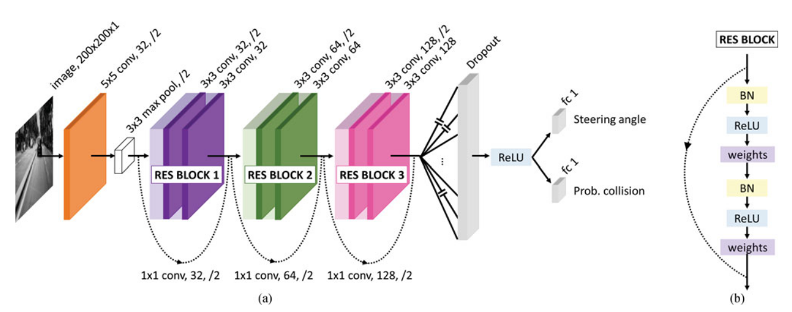

# Obstacle-Avoidance-in-ROS2

In this project we used DroNet model from article "DroNet: Learning to Fly by Driving" for obstacle avoidance task. DroNet is shallow network with three residual blocks and has this architecture:

For this project we used [DeepRacer Robot](https://www.amazon.com/AWS-DeepRacer-Fully-autonomous-developers/dp/B07JMHRKQG) for test and simulation. 

Amazon's DeepRacer robot is an autonomous racing machine designed for reinforcement learning and artificial intelligence (AI) testing. This bot is part of Amazon Web Services (AWS) and serves as an educational platform for people and developers to explore the field of robotics. This robot is equipped with various hardware and software components that facilitate its training and operation.

we solved some challenges and problems of this model to use it in the real and indoor environment, especially on DeepRacer robot. also we tested our code in simulation and real. you can see the testing result in this [link](https://drive.google.com/file/d/1xXyfdtoMg1F5ivq54BOaWthO9qQkOuOz/view?usp=sharing).

